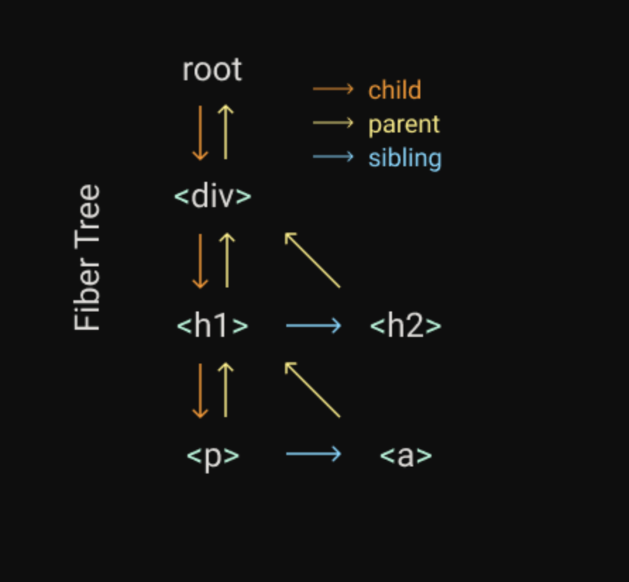

## JSX是如何被解析的

```jsx
const element = <h1 title="foo">Hello</h1>;
```

会被 babel 解析为如下代码:

```jsx
const element = React.createElement("h1", {title: "foo"}, "Hello");
```

接下来实现一个简单的 createElement,用于生成虚拟 DOM:

```jsx

function createElement(type, props, ...children) {

    return {
//元素类型
        type,
//元素的属性
        props: {
            ...props,
            //子元素
            children: children.map(
                child =>
                    typeof child === "object"
                        ? child
                        : createTextElement(child)
            ),
        },
    }
}


function createTextElement(text) {

    return {
        type: "TEXT_ELEMENT",
        props: {
            nodeValue: text,
            children: []
        }
    }
}


```

## 渲染到真实的dom节点上面(React16之前的逻辑:用的是递归遍历的方式)

```js
function render(element, container) {
    const dom =
        element.type == "TEXT_ELEMENT"
            ? document.createTextNode('')
            : document.createElement(element.type)
    //排除 children 属性
    const isProperty = key => key !== "children"

    //将元素一一 写入 dom节点上面
    Object.keys(element.props)
        .filter(isProperty)
        .forEach(name => {
            dom[name] = element.props[name]
        })
    //遍历递归,将子元素一个一个都附到 真实的 dom 节点上面
    element.props.children.forEach(child =>
        render(child, dom)
    )

    //最后挂载到 指定的 dom 节点上面
    container.appendChild(dom)
}
```

## 并发模式（向React16诞生的缘由）

到目前为止,已经实现一个比较简单的React了，可以把JSX渲染到dom上面,但是有一个问题,
就是Render函数是使用递归来实现将子元素一一附着到dom上的,如果节点的层级比较多,节点很多的话,就有可能长时间占用浏览器进程,造成阻塞，

影响浏览器更高优先级别的事物处理（用户的输入和UI交互）.

因此,需要将这个大的任务切割分为多个小的工作单元,这样的话,如果浏览器拥有更高优先级别的事物处理,我们就会中断React元素的渲染;我们称之为“并发模式”；

```js
let nextUnitofWork = null;

function workloop(deadline) {
    //是否要暂停
    let shouldYield = false;

    while (nextUnitofWork && !shouldYield) {
        //执行下一个工作单元  并返回下一个工作单元
        nextUnitofWork = performUniteofWork(nextUnitofWork)
        //判断空闲时间是否足够,如果剩余时间小于1ms(几乎没有剩余时间了)，块钱跳出循环
        shouldYield = deadline.timeRemaining() < 1
    }

    requestIdleCallback(workloop)
}

requestIdleCallback(workloop)

function performUnitofWork() {
    // TODO
}

```

## 什么是 Fiber ，为何我们需要它

注意:这里是面试考点:

在React15以及之前,`Reconciler` 采用递归的方式创建虚拟DOM,递归过程是不能中断的! 如果组件树的层级很深,递归就会占用线程很多时间,造成卡顿。

为了解决这个问题,React16将递归的无法中断的更新重构为异步的可以中断的更新,由于曾经用于递归的虚拟DOM数据结构已经无法满足需要,于是,全新的Fiber架构应运而生.

## Fiber的含义

Fiber包含三层含义:

1.React15 的 Reconcicler 采用递归的方式执行,数据保存在递归调用栈里面, 所以被称为 stack Reconciler ;
React16的Reconciler基于Fiber节点实现,被称为Fiber Reconciler .

2.作为静态数据结构来说,每个Fiber节点对应一个React element, 保存了该组件的类型（函数组件/类组件...）、对应的DOM节点信息;

3.作为动态工作单元而言,每个Fiber节点保存了本次更新中该组件改变的状态,要执行的工作(需要被删除/被插入页面中/被更新...)。

## Fiber结构



上图是一棵Fiber树.为了组织工作单元,我们需要一个数据结构,每个元素都有一个Fiber结构,每个Fiber都是一个工作单元,每个工作单元又是如何工作的,下面的

performUnitOfWork函数,主要做了三件事:

1.把元素添加到dom里面;

2.为元素的子元素都创建一个fiber结构;

3.找到下一个工作单元

```js
function performUnitOfWork(fiber) {
    //创建一个 dom 元素 ，挂载到 fiber 的 dom属性
    if (!fiber.dom) {
        fiber = createDom(fiber)
    }
    //添加 dom 到 父元素上
    if (fiber.parent) {
        fiber.parent.dom.appendChild(fiber.dom)
    }
    const elements = fiber.props.children
    let index = 0
    //保存 上一个 sibling fiber 结构
    let prevSibling = null

    while (index < elements.length) {
        const element = elements[index]

        const newFiber = {
            type: element.type,
            props: element.props,
            parent: fiber,
            dom: null
        }

        //第一个子元素 作为 child, 其余 的子元素 作为 sibling
        if (index === 0) {
            fiber.child = newFiber
        } else {
            prevSibling.sibling = newFiber
        }
        prevSibling = newFiber
        index++
    }
    // 如果有 child fiber,则返回 child
    if (fiber.child) {
        return fiber.child
    }
    let nextFiber = fiber

    while (nextFiber) {
        // steps 如果有 sibling fiber ，则返回 sibling
        if (nextFiber.sibling) {
            return nextFiber.sibling
        }

        //step3,否则返回 他的 parent fiber
        nextFiber = nextFiber.parent
    }
}


```


## Render 和 Commit 阶段都做了什么
上面的 performUnitOfWork里面,每次都把元素添加到dom上,这里


